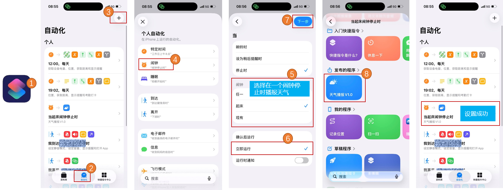
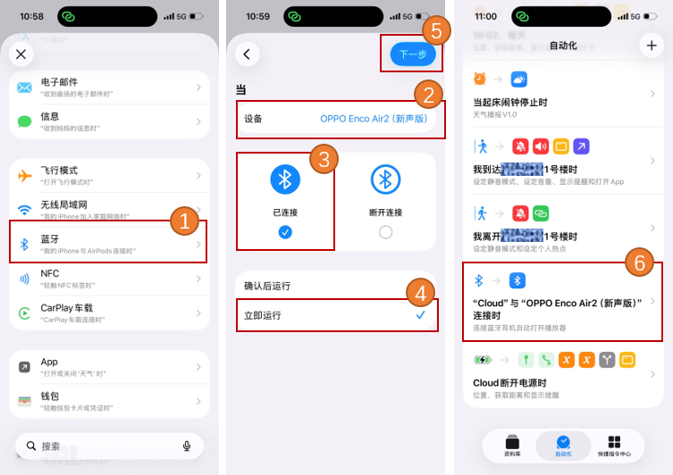
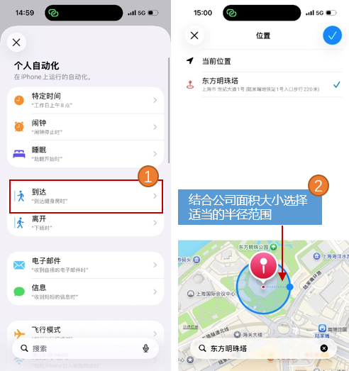
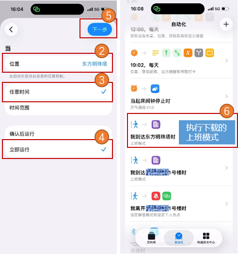
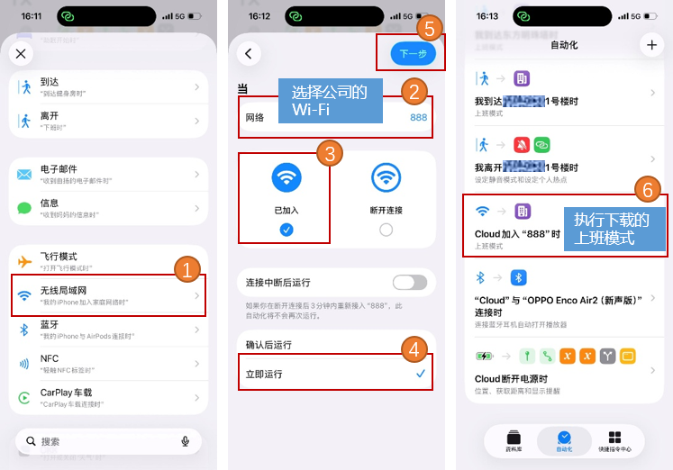
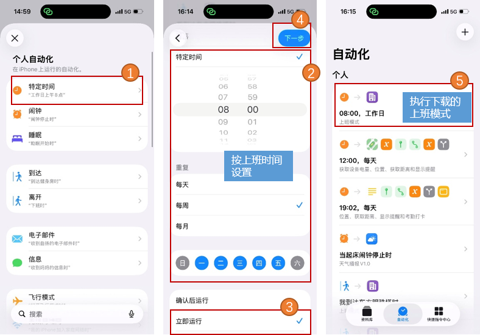
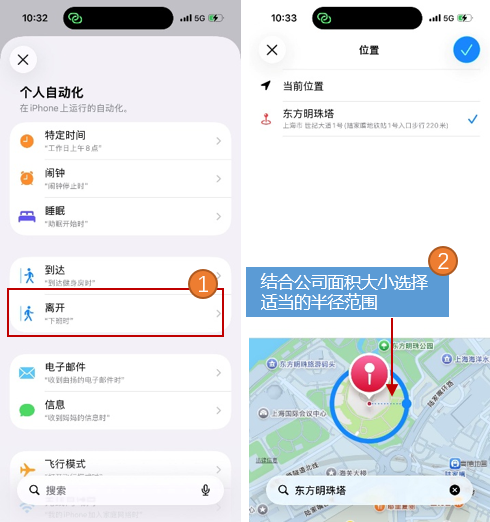
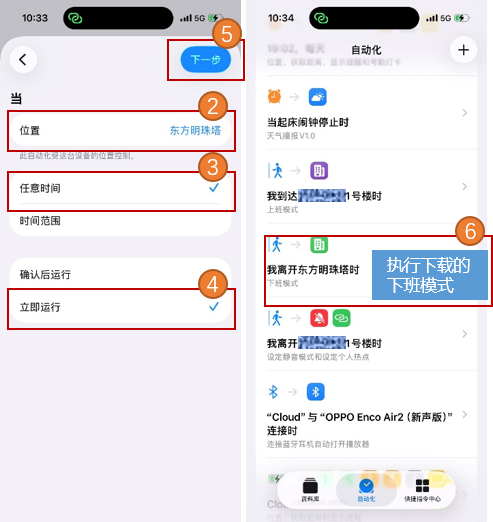
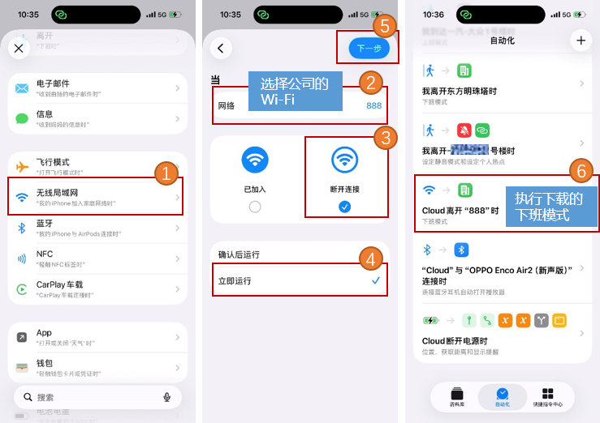
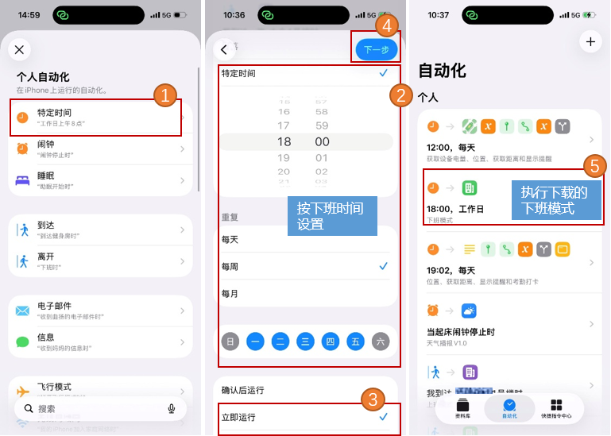

> 这里汇集了所有爆米花快捷指令，欢迎下载使用，如果有任何问题或者修改建议可以通过底部的微信公众号或者邮箱联系我。

## 目录

- [目录](#目录)
- [快捷指令01：天气闹钟](#快捷指令01天气闹钟)
  - [📦功能简介](#功能简介)
  - [🔗下载链接](#下载链接)
  - [⚙️设置方法](#️设置方法)
- [快捷指令02：制作证件照](#快捷指令02制作证件照)
  - [📦功能简介](#功能简介-1)
  - [🔗下载链接](#下载链接-1)
  - [⚙️设置方法](#️设置方法-1)
- [快捷指令03：一键扫码](#快捷指令03一键扫码)
  - [📦功能简介](#功能简介-2)
  - [🔗下载链接](#下载链接-2)
  - [⚙️设置方法](#️设置方法-2)
- [快捷指令04：连接蓝牙耳机自动打开播放器](#快捷指令04连接蓝牙耳机自动打开播放器)
  - [📦功能简介](#功能简介-3)
  - [🔗下载链接](#下载链接-3)
  - [⚙️设置方法](#️设置方法-3)
- [快捷指令05：掷骰子游戏](#快捷指令05掷骰子游戏)
  - [📦功能简介](#功能简介-4)
  - [🔗下载链接](#下载链接-4)
  - [⚙️设置方法](#️设置方法-4)
- [快捷指令06：上班模式](#快捷指令06上班模式)
  - [📦功能简介](#功能简介-5)
  - [🔗下载链接](#下载链接-5)
  - [⚙️设置方法](#️设置方法-5)
- [快捷指令07：下班模式](#快捷指令07下班模式)
  - [📦功能简介](#功能简介-6)
  - [🔗下载链接](#下载链接-6)
  - [⚙️设置方法](#️设置方法-6)
- [快捷指令08：午休免打扰](#快捷指令08午休免打扰)
  - [📦功能简介](#功能简介-7)
  - [🔗下载链接](#下载链接-7)
  - [⚙️设置方法](#️设置方法-7)
- [快捷指令09：照片处理神器](#快捷指令09照片处理神器)
  - [📦功能简介](#功能简介-8)
  - [🔗下载链接](#下载链接-8)
  - [⚙️设置方法](#️设置方法-8)
- [快捷指令10：视频处理大全](#快捷指令10视频处理大全)
  - [📦功能简介](#功能简介-9)
  - [🔗下载链接](#下载链接-9)
  - [⚙️设置方法](#️设置方法-9)
- [📅更新历史](#更新历史)

## 快捷指令01：天气闹钟

### 📦功能简介

根据当前位置信息播报天气，包括天气情况、温度、风速、空气质量等，可以配合闹钟结束等场景实现自动播报天气。

### 🔗下载链接

<https://www.icloud.com/shortcuts/ffe60386370e4f09a7f861402cec0fe5>

### ⚙️设置方法

在自动化中设置指令的自动触发逻辑，此处设置为闹钟结束时开始播报天气。

## 快捷指令02：制作证件照

### 📦功能简介

一键制作证件照，支持红色、蓝色、白色标准背景颜色选择，且支持自定义证件照尺寸，包括一寸、二寸等常用证件尺寸。

### 🔗下载链接

<https://www.icloud.com/shortcuts/898722b552d248ac9b191570d6eaf5fd>

### ⚙️设置方法

打开本快捷指令，选择一张光线明亮、面部清晰的日常自拍或生活照，然后设置背景颜色和尺寸即可自动保存到本地相册。

## 快捷指令03：一键扫码

### 📦功能简介

本快捷指令集成了微信扫码、微信付款码、支付宝扫码、支付宝付款码等常见应用的一键扫码。

### 🔗下载链接

1️⃣一键扫码

<https://www.icloud.com/shortcuts/d19602ed659844bfb61d1dc9fb5b0238>

2️⃣微信扫码

<https://www.icloud.com/shortcuts/e820d00661174d55948324d630a229ff>

3️⃣支付宝扫码

<https://www.icloud.com/shortcuts/a76148146fc64ce884ea540ce596b3b8>

### ⚙️设置方法

点击快捷指令直接使用即可。

## 快捷指令04：连接蓝牙耳机自动打开播放器

### 📦功能简介

当蓝牙耳机连接手机时，自动弹出一个提示框，展示常用的音视频APP（如、网易云、播客、哔哩哔哩等），可以一键选择打开。

### 🔗下载链接

<https://www.icloud.com/shortcuts/654e3ff91b5647cda5b01153c640cd0f>

### ⚙️设置方法

在自动化中设置指令的自动触发逻辑，当连接蓝牙耳机的时候自动执行这条快捷指令。

## 快捷指令05：掷骰子游戏

### 📦功能简介

一个掷骰子的小游戏，可以模拟掷骰子并显示骰子的点数，每次点击会随机产生1-6的骰子点数。

### 🔗下载链接

<https://www.icloud.com/shortcuts/0533492955fd45a381a4237ad72d0b1a>

### ⚙️设置方法

点击快捷指令即可开始掷骰子，点击取消可以退出。

## 快捷指令06：上班模式

### 📦功能简介

到达公司自动进入“上班模式”，手机进入静音状态，避免上班期间电话响起的尴尬，同时提醒上班打卡。

### 🔗下载链接

<https://www.icloud.com/shortcuts/3ee2c78416c54219ad9f98426f86b142>

### ⚙️设置方法

方法1️⃣基于定位，到达公司自动进入上班模式

方法2️⃣连接到公司Wi-Fi自动进入上班模式

方法3️⃣到上班时间自动进入上班模式

## 快捷指令07：下班模式

### 📦功能简介

晚上下班的时候自动进入“下班模式”，手机解除静音，也提醒下班打卡。

### 🔗下载链接

<https://www.icloud.com/shortcuts/9f26f0122c414cc4ba23462cc5b99ad5>

### ⚙️设置方法

方法1️⃣基于定位，离开公司自动进入下班模式

方法2️⃣断开公司Wi-Fi自动进入下班模式

方法3️⃣到下班时间自动进入下班模式

## 快捷指令08：午休免打扰

### 📦功能简介

定义手机免打扰时间段，免打扰期间来电静音，APP不再提醒，免打扰结束后有可以设置闹钟或提醒事项进行提醒。可用于午休期间，开会期间等场景。

### 🔗下载链接

<https://www.icloud.com/shortcuts/3c070d90a51540f48580acad0a7278b1>

### ⚙️设置方法

点击快捷指令设置免打扰时长，选择免打扰结束后的提醒方式。

## 快捷指令09：照片处理神器

### 📦功能简介

本快捷指令集成所有的IOS照片处理能力，包括照片拼接、九宫格裁剪、照片文字识别、照片旋转、照片圆角处理、照片压缩、照片涂鸦、照片GIF制作、网页转照片功能。

### 🔗下载链接

<https://www.icloud.com/shortcuts/dbf585493dcc4a56a370de32be4a21dc>

### ⚙️设置方法

点击快捷指令，选择你想要处理的照片即可。

## 快捷指令10：视频处理大全

### 📦功能简介

本快捷指令实现视频处理能力，包括视频倍速播放、视频压缩、从照片制作GIF、GIF转成视频功能。

### 🔗下载链接

<https://www.icloud.com/shortcuts/ec19186303da4c26a69273f9e82b876e>

### ⚙️设置方法

点击快捷指令，选择你想要处理的视频即可。

## 📅更新历史

| 日期 | 更新内容 |
| :--- | :--: |
| 2026/08/27 |  初始版本  |
| 2026/08/31 |  增加2-10的快捷指令  |